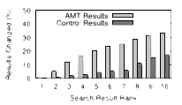

###Measuring Personalization of Web Search
**Paper by Hannek et al.**, **Presented by Dipin Anand & Shaughn Finnerty**

###What is personalization?
- Receiving web page results according to individual's characteristics such as interests, location, context etc.
- Search engines use personalization techniques to provide tailored results to users
	- 2011 blog post by Google states that language, geolocation, search history, Google+ connections being used to personalize web search 

**Concern of Filter Bubble Effect**

- Users are only given results that the personalization algorithm thinks they want (while other, potentially important, results remain hidden)
- Users get separated from information disagreeing with their viewpoints, effectively isolating them in their own cultural or ideological bubbles

###Contributions

**Problem**: To what extent are our search results personalized? What features have an impact on personalizing our search results?

This paper details three main contributions to address this problem:

1. Provides a detailed methodology and similarity measurements for measuring the personalization and differences in search results.
	- The methodology identifies and accounts all possible sources of noise (i.e. factors that could skew results returned) 
2. Uses this methodology on 200 real-world Google users to simply observe the extent of personalization in web search today
	- Determines that on average **12%** of results are personalized to a specific user
3. Explores and identifies the factors of a user that would influence personalization
	- user-provided profile information, web browser and operating system choice, search history, search-result-click history, and browsing history. 

###Noise in Search Results

There are certain factors that can contribute to different search results on their own (i.e. not from personalization). The authors identify these factors and modify their experiments to accomodate them:

- Updates to the search index may may cause results to change over time
	- Authors ensure that a query is executed in parallel (at the same time) for all users in any given experiment
- Distributed infrastructure: different datacenters may house different indexes with inconsistencies, different results
	- Authors use a static DNS entry to make sure that all HTTP requests to Google go to **one** specific IP address
- geolocation: IP addresses can be used to provide localized results
	- Authors ensure that queries are execute from unique IP address, but that these IP addresses come from the same subnet
- A/B Testing: search engines experimenting with results and their click-through rates can cause different results to appear
- Carry-Over: A user searches for query A, followed by query B. Query A influences the results of Query B.
	- E.g. Searching for *hawaii*, followed by *urban outfitters* provides location of urban outfitters in hawaii
	- Authors determine that the carry-over effect is diminished after 10 minutes, so subsequent queries are executed in 10 minute intervals during an experiment

###Experimental Methodology - High Level

1. Create $x$ Google accounts that each vary by one specific feature.
2. Execute $q$ identical queries from each account, once per day for $d$ days. 
3. Save the results of each query
4. Compare the results of the queries to determine whether the **same** results are being served in the **same order** to each account. 
	- If the results vary between accounts, then the changes can be attributed to personalization linked to the given experimental feature.  

In their experiments, they used $q=120$ queries for $d=7$ days.

###Similarity Metrics

**Jacard Index**: $J(A,B) = {{\vert{A \cap B}\vert}\over{\vert{A \cup B}\vert}}$

Given: 

$A$= {a.com, b.com, c.com}
 
$B$= {b.com, c.com, d.com}

$A \cap B$ = {b.com, c.com}
 
$A \cup B$ = {a.com, b.com, c.com, d.com}

$$J(A,B) = {{\vert{A \cap B}\vert}\over{\vert{A \cup B}\vert}} = {2 \over 4} = 0.5$$

**Jacard index of 1 suggests sets are identical. Jacard index of 0 suggests sets are completely not identical (disjoint).**

**Edit Distance**: Number of insertions, deletions, substitutions, swaps required to match two sets

- $EditDistance(\text{{a.com, b.com, c.com}}, \text{{c.com, b.com}}) = 2 $

**A larger edit distance means that the results need a greater amount of reordering to be completely identical in order and contents.**

###Features Contributing to Personalization
Contributing:

- Users with Cookies Enabled & Logged In, Cookies Enabled & Not Logged In, Cookies Disabled
- Users querying from different locations (e.g. Massachusetts, Pensylvania, California, etc.)

Not Contributing:

- Users age, gender, web browser and operating system choice, search history, search-result-click history, and browsing history

###Other Discoveries

- Lower rank results (e.g. 1st result in Google Search Results) less likely to be personalized than results at middle ranks
- Certain query topics are more susceptible to personalization. E.g. Political queries are more likely to be personalized than factual "what is..." queries.
