class: center, middle
#Measuring Personalization of Web Search
##[Paper](http://www.ccs.neu.edu/home/cbw/pdf/fp039-hannak.pdf) by Hannak et al.

###Presented by 

[shaughn.net/pres-web-search](http://shaughn.net/pres-web-search)

---

#Introduction - What is Personalization?

- Web page results according to .blue[individual's characteristics] (interests, location, context etc.)

- .blue[Bing and Google Search] personalize search results for all users
	- Google Search alone receives 17 billion queries per month from U.S. users

- eBay, Amazon customize .blue[recommended products] for different users

<!-- - Recently, Google started including personalized content from the Google+ social network into search results -->

- Personalization provides obvious benefits to users, including .blue[clarity and retrieval of locally relevant results] E.g. boston pizza

- In 2009, Google began personalizing search results for all users, even those without Google accounts
	- Personalizes results based on the .blue[user’s language, geolocation, history of search queries, and their Google+ social connections]

---

#Introduction - Filter Bubble Effect

- A result of a personalized search where a website algorithm .em[selectively guesses what information] a user would like to see

- Users only given results that the .em[personalization algorithm thinks] they want based location, past click behaviour, search history etc. 

	- .em[Separated] from information disagreeing with their viewpoints
	- Isolating them in their own cultural or ideological bubbles

Basic examples of filter bubble effect :

- Google Personalized Search 
- Facebook's personalized news stream

*Increased popularity of .em[alternative search engines] that do not personalize results (e.g., duckduckgo.com) due to concerns of Filter Bubble Effect.*

---

#Contributions - Overview

1. Developed a .em[methodology] for measuring personalization in Web search results

	- Created a command line-based implementation 

2. Used this methodology to measure the .em[extent of personalization] on Google Web Search
	
	- Recruited 200 users with active Google accounts 
	- Ran a predefined list of Web searches  
	- Measured the differences in search results

3. Investigated the .em[causes] of personalization, covering *user-provided profile information, web browser and operating system choice, search history, search-result-click history, and browsing history.* 
	
	- Created numerous Google accounts and assigned each a set of unique behaviors

---

<!-- #Background -  Google Personalization

- Google first introduced “Personalized Search” in 2004
	- Merged into Google Search in 2005
	- In 2009, Google began personalizing search results for all users, even those without Google accounts

- Personalizes results based on the .em[user’s language, geolocation, history of search queries, and their    Google+ social connections]

- Today, Google Accounts are the single point of login for all Google services
	- Google Accounts: A tracking cookie enables all of Google’s services to uniquely identify each logged in user
	- Large advertising networks: Google is capable of tracking users as they browse the Web due to their large advertising networks

**.em[Motivation]**: Very little concrete information published about how Google personalizes search results

--- -->

<!-- #Terminology & Notions

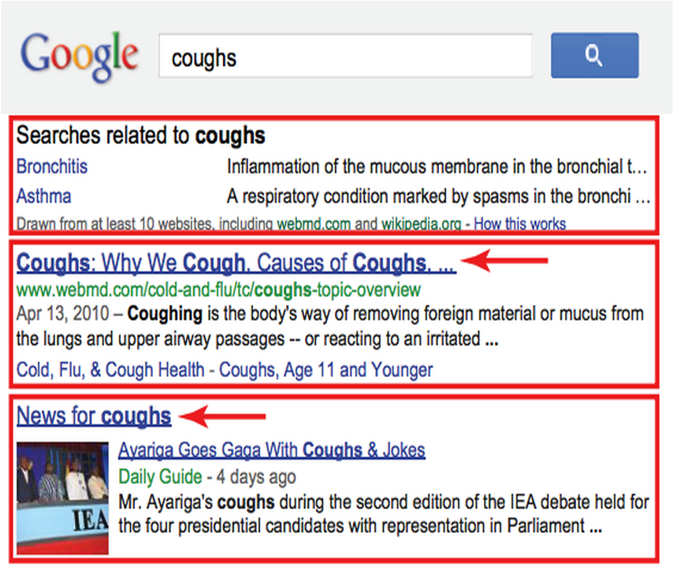

- Query: one or more keywords

- Result: response to a query

- Primary Link: main link in a result
	- Organic: pointing to a third party website eg. WebMD link

	- Primary link may point to another Google service too. eg. “News for coughs”

	- Some do not include a primary link e.g. “The Related Searches result “

--- -->

#Experiment Design

Each experiment follows a similar pattern: 

1. Create `\(x\)` Google accounts that each vary by one specific feature (some without Google accounts).

2. Execute `\(q\)` identical queries from each account, once per day for `\(d\)` days. 

3. Save the results of each query

4. Compare the results of the queries to determine whether the .em[same] results are being served in the .em[same order] to each account. 
	- If the results vary between accounts, then the changes can be attributed to personalization linked to the given experimental feature.  

---

#Noise in Search Results

When developing the method, authors had to be aware of the noise:

- .em[Updating the search index]: query results may change over time

- .em[Distributed Infrastructure]: different datacenters may house different indexes with inconsistencies,  provding different results. 

- .em[Geolocation]: IP address used to provide localized results 
	- different subnets may receive different results

- .em[A/B Testing]: certain results are altered to measure whether users click on them more often. 
	

???

Distributed Infrastructure: It is likely that these differences arise due to inconsistencies in the search index across datacenters.

---

# Noise: Carry-Over Effect

One particular source of noise comes from the influence of one search on subsequent searches:

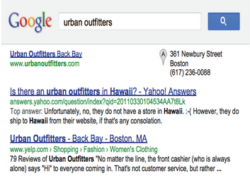

- A user searches for query A, followed by query B. Query A influences the results of Query B.
	- .blue[E.g. Searching for *hawaii*, followed by *urban outfitters*]

Testing Carry-Over:

- In two different browsers, execute first query in one browser, followed by second query at later time

???

---

#Testing Carry-Over

.center[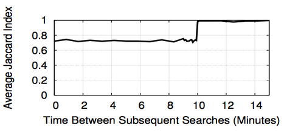]

- Overlap of results when searching for "test" followed by "touring" compared to just "touring"

- Jacard Index of 1 indicates complete similarity
	- When searching "touring" 10 minutes after searching "test", result set is completely similar to searching "touring" on its own

.em[**The remaining tests measuring personalization all ensured queries were executed 10 minutes apart**]

---

#Controlling Noise

1. All queries are executed from Google Search .em[webpage] vs. Google’s API

2. All machines execute searches for the same query at the same time
	- This eliminates differences is query results due to .em[temporal effects]

3. Use static DNS entries to direct all of their query traffic to a specific Google IP
	- This eliminates errors arising from differences between .em[data centers].

4. They wait 11 minutes in-between subsequent queries to avoid .em[carry-over]

5. They send all of the search queries for a given experiment from the same subnet.
	- avoiding noise from .em[geolocation]

6. Sixth, they include a .em[control account] in each of their experiments
	- control is identical to one other account in given experiment

???

In order to control against the noise factors that they identified, the methodology was modified in the following ways:

	- The control account is configured in an identical manner to other account in the given experiment    
	- duplicate of one account in the set of `\(x\)` accounts and ensure that the duplicates retrieve the same results

---

# Demonstrating Real-World Personalization

- Begin by measuring the extent of personalization that typical users see today as a baseline

	- 200 users on various Google Services visited a site that automatically searched 80 queries from randomly selected, but diverse categories
	- Tech, News, Lifestyle, Quirky, Humanities, Science

- Searches executed via .em[proxy] to provide:
	1. A PhantomJS script to run the same query as a "control" user

	2. User queries and control queries are executed in parallel

	3. Google Search requests are made to a hard-coded Google IP address

???

- Demonstrating the difference in search results between a control and Google users with accounts
- Mechanical Turk is a marketplace for work, where you can request work from many workers
- Proxy: A proxy server is a computer that functions as an intermediary between a web browser (such as Internet Explorer) and the Internet
- PhantomJS is a WebKit browser which runs headlessly (i.e. doesn't draw out the the screen). The benefits that brings is speed — if you're controlling an actual program on your computer, you've a certain overhead in booting up the browser, configuring a profile etc.

Proxy Benefits:

1. Control results
	- executed from a "fresh" user with relatively no Google History
	- "Control" result set for comparison
2. Paralell Execution:
	- Elimination of temporal changes in result sets for user and query
3. Hard-coded IP:
	- Both queries should access the same datacenter
	
---

# Real-World Personalization: Results

.center[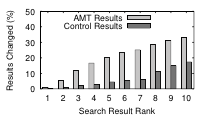]

- Extensive personalization of search results observed. 
	- Real-world user results showed an .em[11.7% higher] likelihood of personalization
	
- Top ranks tend to be .em[less personalized] than bottom ranks.

???

- Compared user results to control results, and control results to each other.
	- Intuitively, the change between control results is simply baseline noise from updating search index, distributed data centers, geolocation, A/B testing, carry-over effect
	- On average, users showed and 11.7% higher likelihood of differing from the control than the control results differing from each other

<!-----

#What Causes Personalization?

- Create `\(x+1\)` accounts where `\(x\)` is the number of options that a feature can have

	- Additional account is a control account with the same features as one other account
	- If no noise is present, these two accounts should provide same results

- Each account searches 120 queries over a period of 7 days
	- Each query is executed at the same time for all accounts

- Each accounts traffic is routed to a unique IP endpoint via SSH tunnel
	- 192.168.1.1 vs. 192.168.1.2

???

After observing that it web searches are clearly personalized from the AMT worker results, authors decided to test what features of a Google Profile caused this personalization?

- x+1 accounts where x is the number of options that a feature can take
	- x=3 for gender
	- "male", "female", "other"
	- additional "female" account for control

- 120 queries are categorically diverse

- Unique IP addresses within \24 subnet
	- IP addresses are unique, but will not be affected by geolocation noise -->

---

class: center, middle

#Features Evaluated

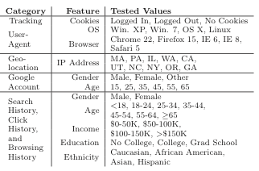

---

#Similarity Metrics

.em[Jacard Index]: `\(J(A,B) = {{\vert{A \cap B}\vert}\over{\vert{A \cup B}\vert}}\)`

Given: 

\(A\)= {a.com, b.com, c.com}
 
\(B\)= {b.com, c.com, d.com}

\(A \cap B\) = {b.com, c.com}
 
\(A \cup B\) = {a.com, b.com, c.com, d.com}

$$J(A,B) = {{\vert{A \cap B}\vert}\over{\vert{A \cup B}\vert}} = {2 \over 4} = 0.5$$

.em[Edit Distance]:
- Number of insertions, deletions, substitutions, swaps required to match two sets
	- `\(EditDistance(\text{{a.com, b.com, c.com}}, \text{{c.com, b.com}}) = 2 \)`

???

- Jacard Index of 1 indicates the intersection is equal to the union.
	- Sets are completely identical
- Jacard index of 0 indicates the intersection contains no elements
	- Sets are completely dissimilar
	
- Edit distance
	- Second set requires the addition of a.com, followed by the swap of c.com and b.com
	- 2 operations

---

#Personalization - Cookies

- 3 Options: Logged In w/ Cookies Enabled, Logged Out w/ Cookies Enabled, Cookies Disabled
	- Control: Cookies disabled

- Results from each query are compared to the results from the control 

.center[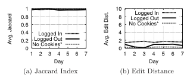]

- **Results provided do not change, but order does**
	- Logged in users with cookies experience an average reordering of 2 in their search results

---

#Personalization - IP Address Geolocation

- 10 different accounts each forwarding their Google Search requests to **remote machines in 10 different states**
	- Control: Account forwarding to Massachusetts

.center[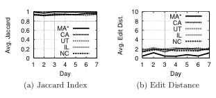]

- Average Jacard Index ~ 0.9
	- 1 **difference** in search results vs. control
	
- Average Edit Distance ~ 2.12
	- 2 **reorderings** needed to match ranking (1-10) of control's search results
	
???

Example:

- Querying "pier one"
	- CA machine produced results including a local news story about a store grand opening in the area of CA
	- MA machine included a Google Maps link to a store in the area

- Conclusion, geolocation is used for personalizing search results

---

#Personalization - Features Not Contributing

- Google Account Attributes (Gender & Age)	

.center[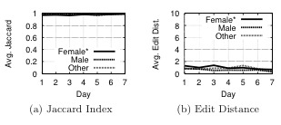]

- Search History
	- 20 accounts specified a demographic attribute (E.g. income level)
	- Before executing the 120 test queries, each account searches 100 queries that individuals in that demographic usually search for

.center[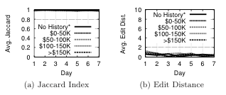]

- Search-Result-Click History, Browsing History

???

- Gender:
	- Jacard Index of 1 indicates same results
	- Edit distance ~0 indicates no reordering in these results
	
- Demographic queries obtained from Quantcast, a site that published top websites and the demographic score for each demographic
	- The query strings are constructed by taking domains from the Quantcast top-2000 that have scores >100 for a particular demographic and removing subdomains and top level domains (e.g., www.amazon.com becomes “amazon”).

- Search-Result-Click History
	- Same procedure as search history, expect the user clicks on the results that are retrieved

- Browsing history
	- Browsing random pages before searching 
	- Pages browsed are ones that would have Google cookies
		- Allows Google to track

---

#Which Queries are More Personalized?

- Plot the cumulative distribution function of the Jacard Index and Edit Distance for all categories across all experiments

.center[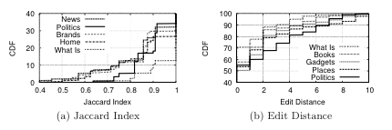]

- For example, _Queries relating to **politics** are more likely to produce personalized results than **"what is..."** queries_

	 - It is more probable that political queries have a lower Jacard Index (less similarity between results)
	 - It is is more probable that "what is..." query have a smaller edit distance (less reordering, additions, removals and swapping) is required to match search results

???

Additional insight into personalization.

- Took the Jacard Index and Edit distance for all queries belong to a specific category across all experiments

Jacard Index:

- Probability that a query relating to politics will have a Jacard Index `\(<=\)` 0.9 `\(~=\)` 35%
	- Probability that 1 result will differ between result sets of size 10
	
- Probability that a "what is..." query will have a Jacard Index `\(<=\)` 0.9 `\(~=\)` 12%
	- It is less likely that search result sets will be different

Edit Distance:

- Probability that a query relating to politics will have a Edit Distance `\(<=\)` 2 `\(~=\)` 60%
	- Probability that at most 2 reordings are required
	
- Probability that a "what is..." query will have a Jacard Index `\(<=\)` 2 `\(~=\)` 78%
	- It is more likely that "what is..." query results will need less reording

---

#Which Rankings are More Volatile?

- For each result at rank `\(r\in[1,10]\)` for all test accounts, compare this result to the same result at rank `\(r\)` in the control account's result set.
	- If different, consider this a changed result at rank `\(r\)`

- To determine the results changed for a rank `\(r\)` as a percentage:
	- Divide the number of changed results at `\(r\)` for a query, by the total number of results at rank `\(r\)` for that query

- **Idea**: *Ranks that produced more changed results from control will have a higher percentage of results changed in the plot*

---

.center[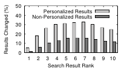]

- Personalized results: cookie experiment, and the geolocation experiment

##Results:

- Volatility of rank is not uniform

- Personalized search results are more susceptible to ranking volatility 

???

Result changes on non-personalize pages represent noise

Results ranked 1 are not likely to move in rank
Results ranked 6 are the most likely to move in rank

---

#Conclusion

The authors provide three contributions to studying personalization of web search by:

1. Providing a detailed methodology for measuring web search personalization 

2. Showing that ~12% of results are personalized for 200 real-world users using this approach

3. Identifying features that contribute and don't contribute to web search personalization using this methodology in automated accounts

???

It identifies and compensates for sources of noise in search engines

Noise:
- temporal changes in search indexes
- distributed infrastructure and datacenters
- geolocation
- A/B testing

The authors provide a stepping stone to investigating more areas of web search personalization:
- Investigating beyond accounts in the US
- Investigating more features that could contribute to personalization 

---

class: center, middle
#Thank You!
##Questions

